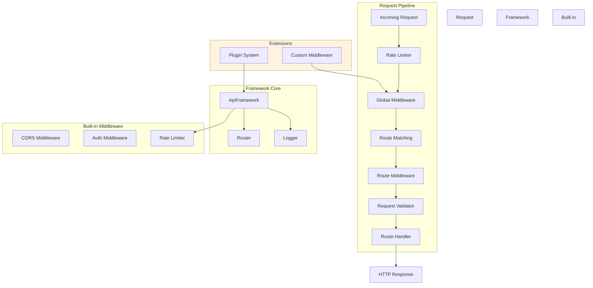
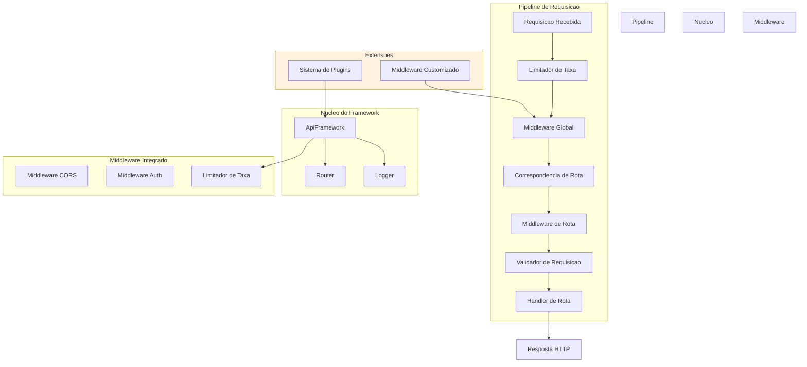

# Enterprise API Framework TS

<div align="center">


</div>


Production-ready TypeScript REST API framework with middleware pipeline, dynamic routing, request validation, rate limiting, and plugin architecture.

[English](#english) | [Portugues](#portugues)

---

## English

### Overview

A modular API framework built in TypeScript that provides enterprise-grade features such as parameterized routing, composable middleware chains, request validation with schema rules, rate limiting, CORS handling, authentication middleware, and a plugin system for extensibility.

### Architecture



### Features

- Dynamic route matching with URL parameters (e.g., /users/:id)
- Composable middleware pipeline with global and per-route middleware
- Request validation with schema-based rules (type, length, pattern, range)
- Configurable rate limiting per client
- CORS middleware factory
- JWT-style authentication middleware
- Plugin architecture for framework extensions
- Structured logging with timestamps and levels
- Full TypeScript type safety

### Quick Start

```bash
git clone https://github.com/galafis/Enterprise-API-Framework-TS.git
cd Enterprise-API-Framework-TS
npm install
npm run dev
```

### Project Structure

```
Enterprise-API-Framework-TS/
├── main.ts            # Framework core with all components
├── tests/
│   └── main.test.ts   # Test suite
├── tsconfig.json
├── package.json
└── README.md
```

### Tech Stack

| Technology | Purpose |
|------------|---------|
| TypeScript | Type-safe framework implementation |
| Node.js | Runtime environment |

### License

MIT License - see [LICENSE](LICENSE) for details.

### Author

**Gabriel Demetrios Lafis**
- GitHub: [@galafis](https://github.com/galafis)
- LinkedIn: [Gabriel Demetrios Lafis](https://linkedin.com/in/gabriel-demetrios-lafis)

---

## Portugues

### Visao Geral

Um framework de API modular construido em TypeScript que fornece recursos de nivel empresarial como roteamento parametrizado, cadeias de middleware composiveis, validacao de requisicoes com regras de esquema, limitacao de taxa, tratamento de CORS, middleware de autenticacao e um sistema de plugins para extensibilidade.

### Arquitetura



### Funcionalidades

- Correspondencia dinamica de rotas com parametros de URL
- Pipeline de middleware composivel com middleware global e por rota
- Validacao de requisicoes com regras baseadas em esquema
- Limitacao de taxa configuravel por cliente
- Fabrica de middleware CORS
- Middleware de autenticacao estilo JWT
- Arquitetura de plugins para extensoes do framework
- Logging estruturado com timestamps e niveis
- Seguranca de tipos completa com TypeScript

### Inicio Rapido

```bash
git clone https://github.com/galafis/Enterprise-API-Framework-TS.git
cd Enterprise-API-Framework-TS
npm install
npm run dev
```

### Estrutura do Projeto

```
Enterprise-API-Framework-TS/
├── main.ts            # Nucleo do framework com todos os componentes
├── tests/
│   └── main.test.ts   # Suite de testes
├── tsconfig.json
├── package.json
└── README.md
```

### Licenca

Licenca MIT - veja [LICENSE](LICENSE) para detalhes.

### Autor

**Gabriel Demetrios Lafis**
- GitHub: [@galafis](https://github.com/galafis)
- LinkedIn: [Gabriel Demetrios Lafis](https://linkedin.com/in/gabriel-demetrios-lafis)
